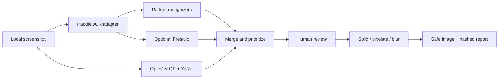

# ScreenShield Local

> Review and redact secrets, PII, faces and QR codes before sharing a screenshot.

ScreenShield Local is a local-first privacy review tool for developers and office
workers. It combines OCR, deterministic secret recognizers, optional Presidio,
QR/face detection and an explicit review step. It never edits the original and
never writes raw detected values to its report.


## See it work

```bash
python -m venv .venv
# Windows: .venv\Scripts\activate
# macOS/Linux: source .venv/bin/activate
python -m pip install -e ".[demo]"
screenshield demo
```

The generated support-console screenshot contains synthetic English/Russian PII,
a valid test card number, fake API keys, a database URL, a generated avatar and a
QR code. The safe image and report appear in `demo/generated/`.

| Before | After |
|---|---|
| Synthetic secrets are visible | High-risk regions are redacted; review-only findings remain visible |

## What it finds

- Email, EN/RU phone numbers, IPv4 and Russian passport patterns.
- Luhn-valid payment cards.
- JWT, bearer tokens, private-key headers and database connection URLs.
- GitHub, AWS and OpenAI-style keys.
- Tokenized URLs, low-confidence EN/RU names and addresses.
- QR codes and faces through the optional OpenCV adapter.

High-risk secrets are selected by default. Names, addresses, faces and IP addresses
require an explicit decision because context determines whether they are sensitive.

## Local app

```bash
python -m pip install -e ".[app,ocr,pii,vision]"
streamlit run src/screenshield/app.py
```

The UI displays the original and annotated images side by side. Every detection has
an independent checkbox and a `solid`, `pixelate` or `blur` action.

## CLI

```bash
screenshield scan screenshot.png --lang en
screenshield sanitize screenshot.png --mode solid
screenshield batch ./screenshots --output ./safe --lang ru
screenshield evaluate --output ./demo/evaluation.json
```

## Architecture



## Privacy properties

- The core contains no HTTP client, analytics or telemetry.
- The source path and pixels are never overwritten.
- Output images are re-encoded without EXIF metadata.
- Reports contain masked previews and SHA-256 digests, not detected values.
- Payment-card candidates must pass Luhn validation.
- Model/regex results remain visible and reversible until export.

## Evaluation

The synthetic fixture provides known OCR boxes and expected detection categories.
Tests enforce at least 95% recall for deterministic high-risk categories, ensure
that raw secrets never enter the report, verify Luhn rejection, cover all three
redaction modes, strip EXIF and reject corrupt images.

The committed [`demo/evaluation.json`](demo/evaluation.json) reports 7/7 required
categories, zero unexpected categories and zero raw fixture values in the privacy
report. This measures the deterministic fixture, not open-world OCR or NER quality.

```bash
python -m pip install -e ".[dev,demo]"
pytest
ruff check .
```

Ordinary CI uses explicit OCR/visual fixtures and never downloads a model. A separate
manual workflow smoke-tests PaddleOCR, Presidio and OpenCV.

## Threat model and limitations

- ScreenShield reduces accidental disclosure; it cannot prove that an image is safe.
- OCR may miss small, stylized, rotated or low-contrast text.
- Generic high-entropy strings are intentionally not auto-redacted to limit noise.
- Names and addresses are context-sensitive and are not selected automatically.
- Blur and pixelation may be inappropriate for highly sensitive secrets; solid fill
  is the default for those categories.
- The Streamlit development server is local tooling, not a hardened public service.
- Screenshots may expose sensitive visual context that no detector category covers.

## License

MIT
