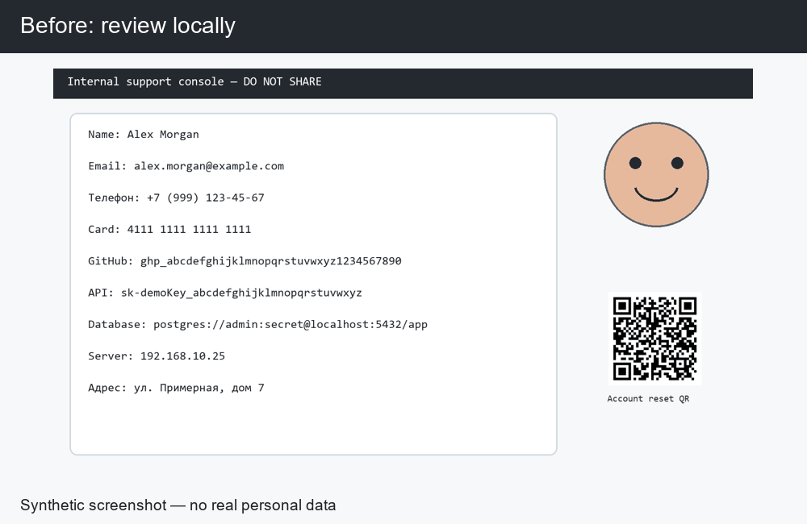
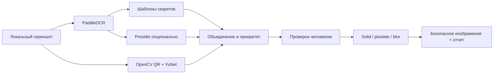

[English](README.md) | [Русский](README.ru.md)

# ScreenShield Local

> Находит и скрывает секреты, персональные данные, лица и QR-коды до публикации скриншота.

ScreenShield Local — локальный инструмент проверки скриншотов для разработчиков и
офисных сотрудников. Он объединяет OCR, детерминированные recognizers, Presidio,
обнаружение QR-кодов и лиц с обязательным этапом ручной проверки. Программа не изменяет
оригинал и не записывает найденные значения в отчёт в открытом виде.



## Быстрый запуск

Установите [uv](https://docs.astral.sh/uv/getting-started/installation/), клонируйте
репозиторий и запустите файл для своей операционной системы. Скрипт подготовит Python 3.12,
создаст `.venv`, установит зафиксированные локальные AI-зависимости, проверит модель YuNet
и откроет интерфейс по адресу `http://127.0.0.1:8501`.

**Windows:** дважды щёлкните по `run.bat` или выполните:

```powershell
.\run.bat
```

**Windows PowerShell:**

```powershell
.\run.ps1
```

**macOS / Linux:**

```bash
chmod +x run.sh
./run.sh
```

Первый запуск загружает зависимости PaddleOCR, Presidio и OpenCV, а также небольшую
модель YuNet с проверкой SHA-256. Флаг `-SkipModel` в Windows или `--skip-model` в
macOS/Linux запускает приложение без модели лиц. Флаг `-SetupOnly` или `--setup-only`
подготавливает окружение без запуска сервера.

## Демонстрация

```bash
uv sync --locked --extra demo
uv run screenshield demo
```

Генерируется синтетический скриншот консоли поддержки с англо- и русскоязычными
персональными данными, тестовой картой, фиктивными API-ключами, URL базы данных,
аватаром и QR-кодом. Безопасная копия и отчёт сохраняются в `demo/generated/`.

## Что обнаруживается

- Email, телефоны EN/RU, IPv4/IPv6 и шаблоны российского паспорта.
- Банковские карты, прошедшие проверку Luhn.
- JWT, bearer tokens, заголовки private keys и строки подключения к базам данных.
- Ключи в форматах GitHub, AWS и OpenAI-style.
- URL с токенами, имена и адреса с пониженной уверенностью.
- QR-коды и лица через локальный OpenCV/YuNet.

Высокорисковые секреты выбраны по умолчанию. Имена, адреса, лица и IP-адреса требуют
решения пользователя, поскольку их чувствительность зависит от контекста.

## Ручной запуск интерфейса

Файлы запуска выше являются рекомендуемым способом. Эквивалентные ручные команды:

```bash
uv sync --locked --extra app --extra ocr --extra pii --extra vision
uv run screenshield install-models
uv run streamlit run src/screenshield/app.py
```

Интерфейс показывает оригинал и предварительный результат рядом. Для каждого detection
доступны отдельный переключатель и режим `solid`, `pixelate` или `blur`. Команда
`install-models` загружает закреплённый YuNet ONNX, проверяет SHA-256 и хранит его вне
репозитория. PaddleOCR загружает языковые модели при первом использовании.

## CLI

```bash
uv run screenshield scan screenshot.png --lang en --presidio
uv run screenshield sanitize screenshot.png --policy strict --mode solid
uv run screenshield batch ./screenshots --output ./safe --lang ru
uv run screenshield install-models
uv run screenshield evaluate --output ./demo/evaluation.json
```

## Архитектура



## Приватность

- Сканирование и скрытие данных не используют внешний inference API.
- Streamlit слушает только `127.0.0.1`.
- Единственная встроенная сетевая операция — явная установка YuNet с проверкой хеша.
- Исходный путь и пиксели никогда не перезаписываются.
- Выходное изображение перекодируется без EXIF.
- Отчёт содержит маскированные previews и SHA-256, но не исходные секреты.
- Номера карт принимаются только после проверки Luhn.
- Результаты доступны для проверки до экспорта.

## Проверка качества

Синтетический fixture содержит известные OCR-координаты и ожидаемые категории. Тесты
проверяют recall детерминированных категорий, отсутствие сырых секретов в отчёте,
Luhn, три режима скрытия, удаление EXIF и обработку повреждённых изображений.

```bash
uv sync --locked --extra dev --extra demo --extra app
uv run pytest -m "not integration"
uv run ruff check .
uv run mypy src/screenshield
```

Обычный CI не загружает модели. Отдельный ручной workflow проверяет реальные PaddleOCR,
Presidio, QR detection и YuNet на синтетических данных и лицензированном face fixture.

## Модель угроз и ограничения

- ScreenShield снижает вероятность утечки, но не может доказать безопасность изображения.
- OCR может пропустить мелкий, повёрнутый, стилизованный или малоконтрастный текст.
- Имена и адреса зависят от контекста и не выбираются автоматически.
- Для критичных секретов следует применять сплошную заливку, а не blur или pixelation.
- Streamlit — локальный инструмент разработки, а не публичный многопользовательский сервис.
- Визуальный контекст может раскрывать данные, не относящиеся ни к одной категории detector.

## Лицензия

MIT
